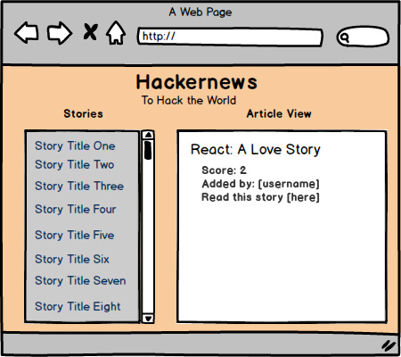

# Hack the world with...

As a developer you will always have to be up-to-date with industry news. [Hackernews](http://thehackernews.com/) is a wonderful resource for this! It also has a super duper [API](https://github.com/HackerNews/API), which you will use this weekend to build a cool Hackernews app!

## First things first!

Check out the [Hackernews API](https://github.com/HackerNews/API). Make sure you read it thoroughly and check out a couple of endpoints in Postman! 

## Mockup

### Deliverables

1. Your application should render news titles in a scrollbar within a div, on window load.
2. When the title is clicked, information about the article should display.
3. Style, Style it, like never before!
4. **REMINDER** Commit early! Commit often! No excuse!